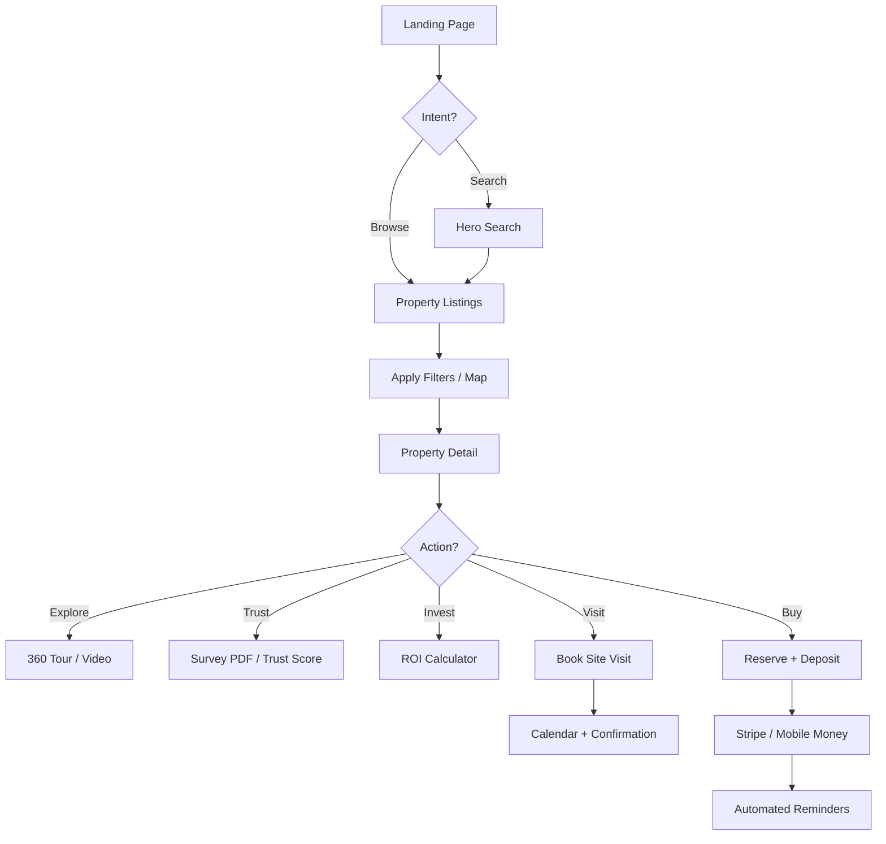
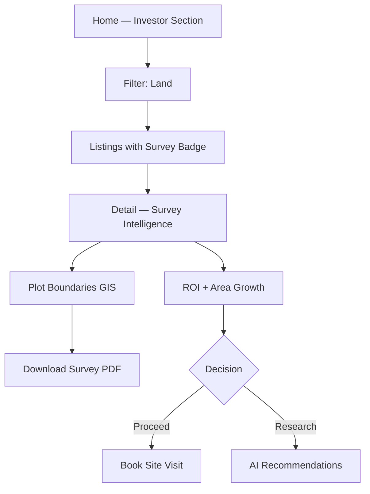
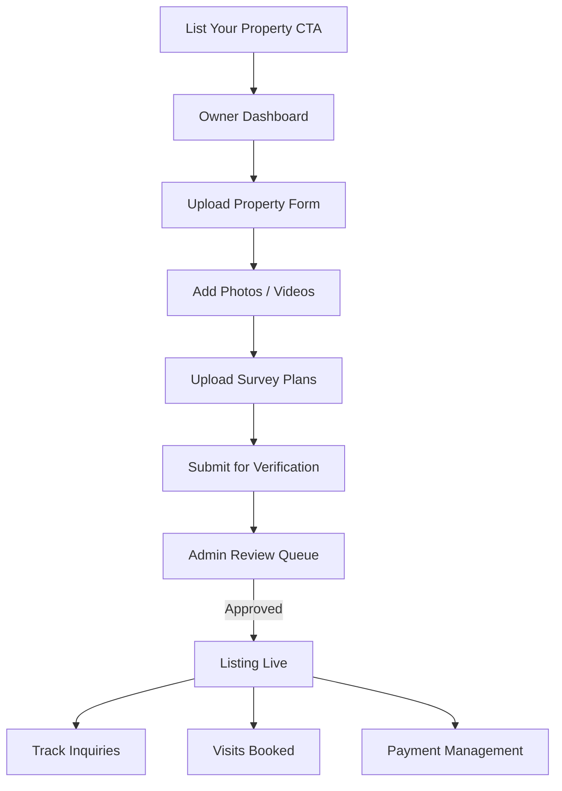
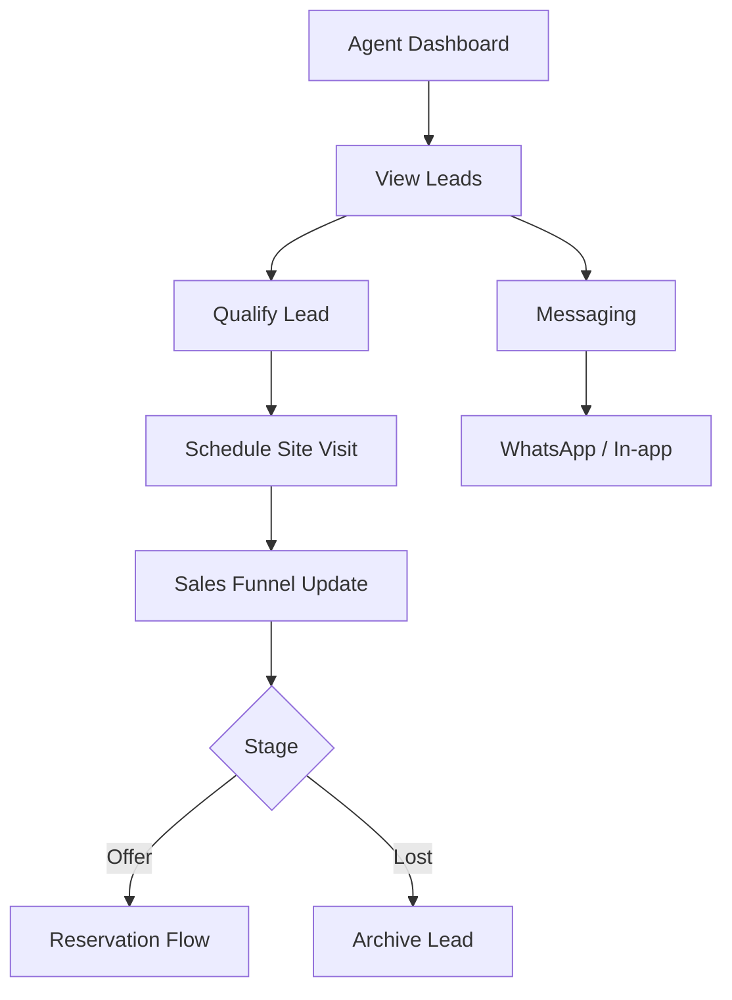
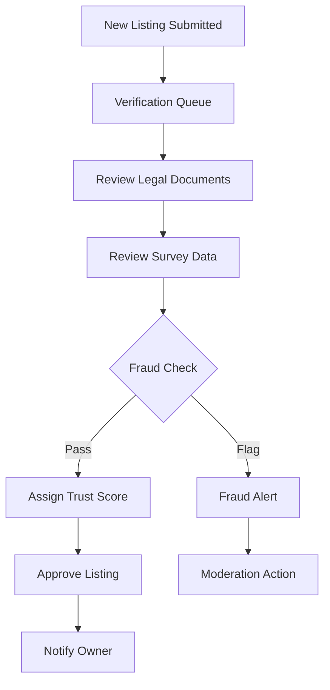

# User Flows — Car House Real Estate

## 1. Buyer / Renter Journey

**Key conversion points:**
1. Hero search → listings (≤2 clicks)
2. Detail page sticky CTAs always visible
3. WhatsApp for instant agent contact
4. Trust score visible before financial commitment

---

## 2. Land Investor Journey

---

## 3. Property Owner Journey

---

## 4. Agent Journey

---

## 5. Admin Verification Flow

---

## 6. Booking & Payment Flow

| Step | User action | System response |
|------|-------------|-----------------|
| 1 | Click "Book Site Visit" | Open calendar modal |
| 2 | Select date/time | Check agent availability |
| 3 | Confirm | Create visit record + email/SMS |
| 4 | Click "Reserve Online" | Deposit amount display |
| 5 | Pay (Card / Mobile Money) | Stripe / local gateway |
| 6 | Success | Reservation locked + reminders scheduled |

**Reminder schedule:** T-24h, T-2h before visit; payment receipt immediately.

---

## 7. AI Smart Experience (Planned)

1. User browses + saves favorites
2. System builds preference profile (type, budget, location)
3. Home page shows "Recommended for you"
4. Investor mode surfaces high-ROI matches
5. Email digest of new matching listings
